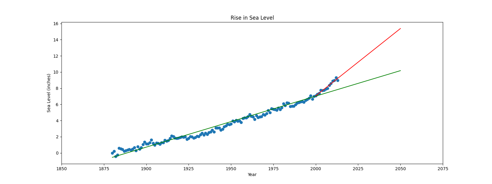

# Sea Level Predictor

Hello everyone, this is the FreeCodeCamp project submitted by me for the [Sea Level Predictor](https://www.freecodecamp.org/learn/data-analysis-with-python/data-analysis-with-python-projects/sea-level-predictor) for the certification of [Data Analysis with Python](https://www.freecodecamp.org/learn/data-analysis-with-python/).

Here are the instructions provided for the project:

<strong>Instructions</strong>

You will analyze a dataset of the global average sea level change since 1880. You will use the data to predict the sea level change through year 2050.  

Use the data to complete the following tasks:  

- Use Pandas to import the data from [`epa-sea-level.csv`](./epa-sea-level.csv).
- Use matplotlib to create a scatter plot using the Year column as the x-axis and the CSIRO Adjusted Sea Level column as the y-axis.
- Use the `linregress` function from `scipy.stats` to get the slope and y-intercept of the line of best fit. Plot the line of best fit over the top of the scatter plot. Make the line go through the year 2050 to predict the sea level rise in 2050.
- Plot a new line of best fit just using the data from year 2000 through the most recent year in the dataset. Make the line also go through the year 2050 to - predict the sea level rise in 2050 if the rate of rise continues as it has since the year 2000.
- The x label should be Year, the y label should be Sea Level (inches), and the title should be Rise in Sea Level.

The boilerplate also includes commands to save and return the image.

**Development**  
Write your code in [`sea_level_predictor.py`](./sea_level_predictor.py). For development, you can use [`main.py`](./main.py) to test your code.
 

**Testing**  
The unit tests for this project are in [`test_module.py`](./test_module.py). We imported the tests from [`test_module.py`](./test_module.py) to [`main.py`](./main.py) for your convenience.
 

**Submitting**  
Copy your project's URL and submit it to freeCodeCamp.
 

**Data Source**  
Global Average Absolute Sea Level Change, 1880-2014 from the US Environmental Protection Agency using data from CSIRO, 2015; NOAA, 2015.

<strong>Result</strong>

